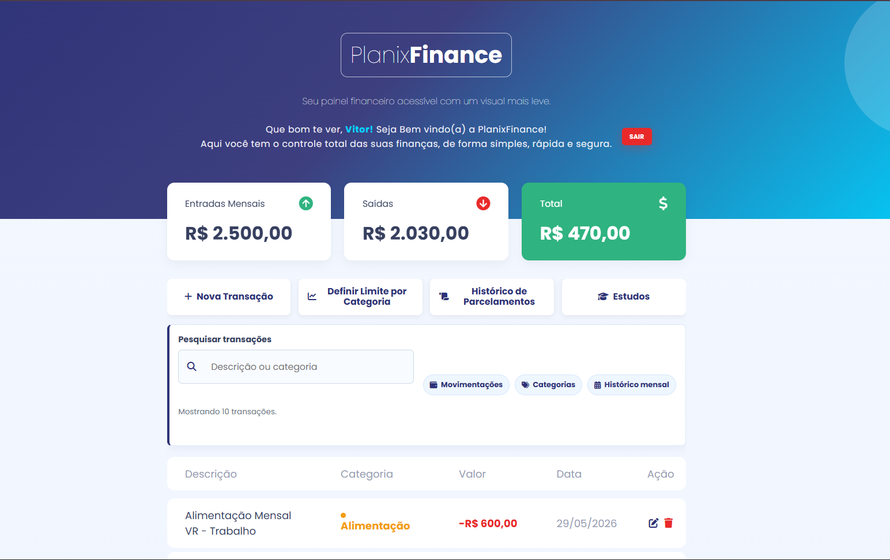
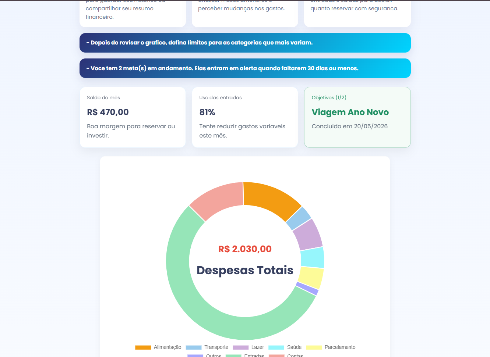
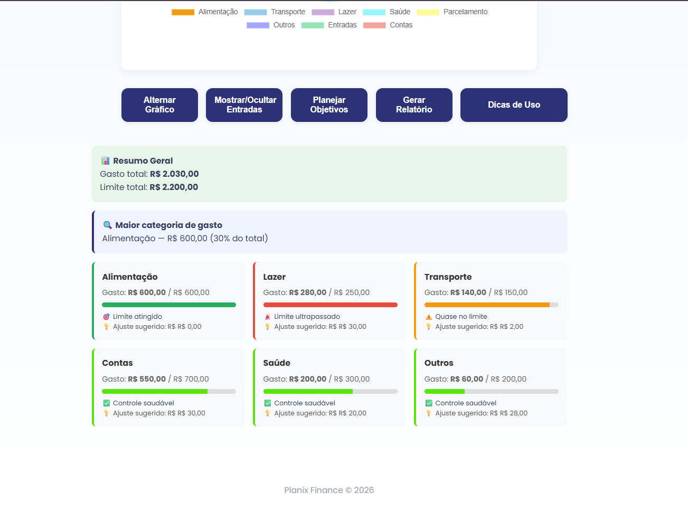
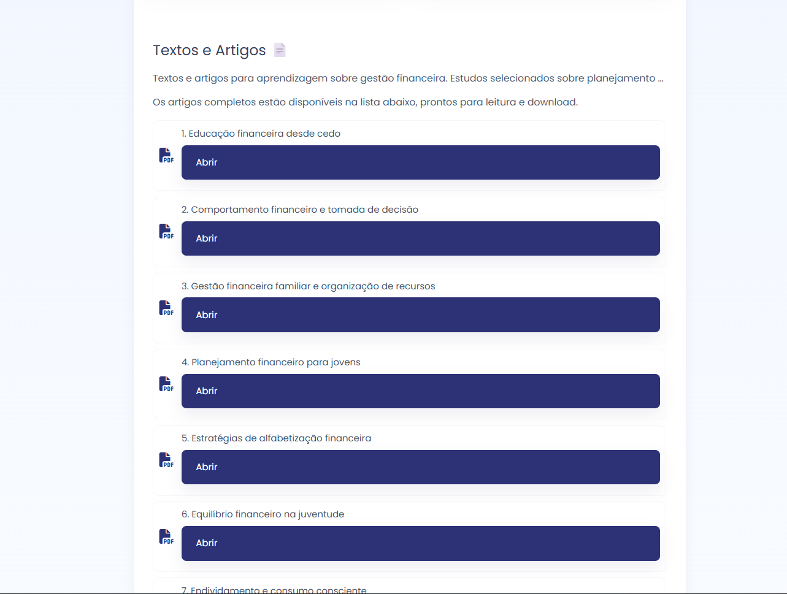
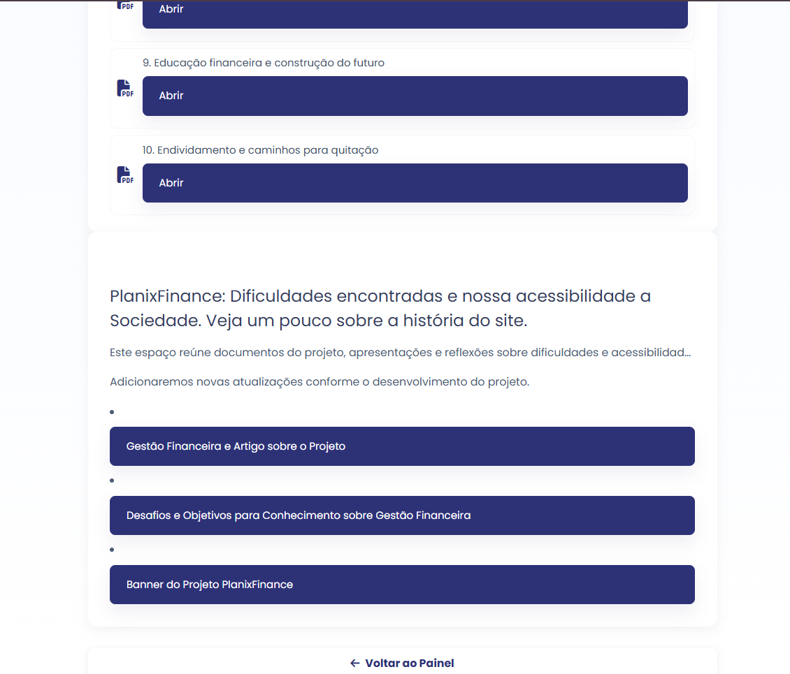

# PlanixFinance

## 👋 Bem-vindo ao PlanixFinance!

Seja muito bem-vindo(a) ao **PlanixFinance**! Este projeto nasceu do desejo de transformar a relação que as pessoas têm com o próprio dinheiro, unindo tecnologia, praticidade e conhecimento.

### 💡 Por que a Educação e a Gestão Financeira importam?

Em uma sociedade cada vez mais dinâmica e cheia de estímulos ao consumo, a falta de orientação financeira muitas vezes se traduz em estresse, endividamento e na perda de oportunidades para o futuro. 

A **educação financeira** vai muito além de apenas "saber economizar". Ela representa:
*   **Autonomia e Liberdade:** Capacidade de tomar decisões conscientes e planejar o amanhã sem o peso das dívidas.
*   **Segurança Social:** Uma sociedade financeiramente educada é mais estável, resiliente a crises e economicamente ativa.
*   **Realização de Sonhos:** Transformar metas abstratas (como uma viagem, um curso ou a casa própria) em objetivos reais através de planejamento e acompanhamento visual.

O **PlanixFinance** foi desenvolvido justamente para ser essa ferramenta de apoio. Mais do que registrar números, ele foi projetado para gerar *insights*, criar hábitos saudáveis e oferecer um espaço de aprendizado contínuo (através da nossa **Página de Estudos**), provando que o controle financeiro pode ser simples, intuitivo e transformador.

---

## 🚀 Overview

**PlanixFinance** é um painel de gestão financeira pessoal com foco em controle local via XAMPP. Ele combina PHP, MySQL, JavaScript e uma interface moderna para ajudar a visualizar gastos, metas e parcelamentos de forma simples.

## 📸 Galeria de Screenshots

### Página Inicial - Dashboard

*Dashboard com saldo total, entradas, saídas e resumo do mês*

*Histórico de transações com filtro por mês e ações de edição/exclusão*

*Painel de metas financeiras e indicadores de urgência*

### Página de Estudos

*Seção de artigos e recursos educacionais sobre gestão financeira*

*Conteúdo de dicas e estratégias para melhorar finanças pessoais*

*Materiais de suporte com links para vídeos e artigos externos*

*Informações sobre o desenvolvimento e equipe PlanixFinance*

## ✨ Destaques

- Login e cadastro seguro com senha hash
- Controle de despesas e receitas
- Histórico mensal de transações
- Parcelamentos automáticos com geração de parcelas
- Metas financeiras com ativação e conclusão
- Limites por categoria para controle de gastos
- Dashboard resumido com saldo, entradas e saídas
- Conteúdo de estudos e ajuda financeira

## 🧩 Funcionalidades principais

### Autenticação
- Cadastro de usuário
- Login seguro com senha criptografada
- Redirecionamento para painel após login

### Transações
- Registro de entradas e saídas
- Edição e exclusão de lançamentos
- Visualização de histórico por mês
- Geração de alertas e insights financeiros

### Parcelamentos
- Cadastro de parcelamentos em série
- Inclusão das parcelas automaticamente em `transacoes`
- Exclusão de parcelamento com remoção de parcelas

### Objetivos
- Criação de metas financeiras com valor e prazo
- Ativação do objetivo ativo para controle prioritário
- Registro de conclusão de metas com data

### Limites e indicadores
- Definição de limites por categoria
- Cálculo de saldo anterior, entradas, saídas e saldo total
- Painel de inteligência com dados do mês atual

## Páginas do Projeto

### 1. **Página Inicial (index.php)**
A página principal após login que funciona como dashboard financeiro. Apresenta:
- **Cards de resumo**: saldo total, entradas do mês, saídas do mês
- **Navegação por mês**: permite visualizar dados de períodos anteriores
- **Tabela de transações**: lista completa de lançamentos com opções de editar ou excluir
- **Painel de alertas**: notificações sobre metas urgentes e objetivos concluídos
- **Cards de insights**: resumo inteligente de gastos e metas em progresso

### 2. **Página de Autenticação (pages/auth/)**
- **login.php**: tela de acesso com validação de credenciais
- **cadastro.php**: formulário para criação de nova conta
- **esqueci_senha.php**: fluxo de recuperação de senha (requer hospedagem)
- **perfil.php**: visualização e edição de dados do usuário
- **logout.php**: encerramento de sessão

### 3. **Página de Estudos (pages/estudos.html)**
Página de educação financeira com:
- **Artigos educacionais**: conteúdo sobre gestão pessoal e dicas práticas
- **Seções temáticas**: organização por tópicos (economia, investimento, planejamento)
- **Links externos**: referências a recursos adicionais e vídeos
- **Design responsivo**: adaptado para mobile e desktop

## 🛠 Tecnologias usadas

- PHP 7.x / 8.x
- MySQL / MariaDB
- HTML5
- CSS3
- JavaScript
- Font Awesome
- Google Fonts
- XAMPP (Apache + MySQL)

## ⚙️ Requisitos

- XAMPP instalado no Windows
- Apache e MySQL ativos
- PHP habilitado
- Banco de dados local com suporte MySQL

## 🧱 Configuração local

1. Copie o projeto para `C:\xampp\htdocs\Site_final`
2. Abra o painel do XAMPP e inicie o Apache e o MySQL
3. Acesse `http://localhost/phpmyadmin`
4. Crie o banco de dados `projeto_gestao`
5. Importe as tabelas usando o script SQL no `config/database.php`

### Tabelas necessárias

- `usuarios`
- `transacoes`
- `parcelamentos`
- `limites`
- `objetivos`

> O arquivo `config/database.php` já usa `localhost`, `root` e senha vazia por padrão. Ajuste se estiver usando outro usuário.

## ▶️ Como executar

1. Abra no navegador: `http://localhost/Site_final/index.php`
2. Crie uma conta em `pages/auth/cadastro.php`
3. Faça login e use o painel financeiro

## 📁 Estrutura de pastas

- `actions/` - ações em PHP para salvar, editar e excluir dados
- `config/` - configuração do banco de dados
- `pages/auth/` - páginas de autenticação e perfil
- `src/css/` - estilos do projeto
- `src/js/` - lógica e interatividade do painel
- `src/assets/` - imagens, vídeos e arquivos estáticos

## 📌 Observações importantes

- O projeto exige backend PHP e banco de dados MySQL.
- Use o GitHub para versionar o código e compartilhar apenas o projeto.
- Sempre mantenha o banco de dados local sincronizado ao clonar ou mover o projeto.
